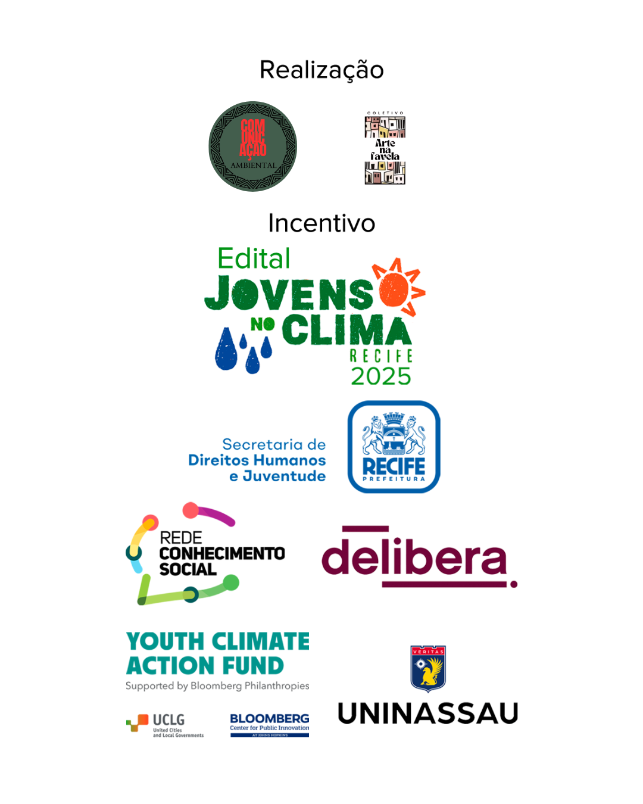

# 🌿 EcoVision 2.0 – Monitoramento Ambiental com IA

O EcoVision é uma plataforma web para monitoramento ambiental de queimadas no Brasil, desenvolvida durante as aulas de tecnologia do projeto **Comunicação Ambiental**, apoiado pelo **Jovens no Clima**.

O objetivo é demonstrar como a tecnologia pode ser uma ferramenta poderosa para jovens da periferia no combate às crises climáticas, unificando análise de dados, visão computacional (Deep Learning) e previsão de risco (Machine Learning).

---

## 🚀 Como Funciona

O sistema é dividido em três módulos principais, acessíveis após um login:

1.  **Dashboard Analítico:** Carrega dados históricos de 6 biomas brasileiros (diretamente do GitHub) e permite a filtragem dinâmica de focos de queimada por Bioma e Estado, com gráficos e dados brutos para download.

2.  **Reconhecimento de Fogo (IA):** Utiliza a webcam do dispositivo (PC ou celular) e um modelo de Deep Learning (YOLOv8) treinado especificamente para detectar focos de **fogo** e **fumaça** em tempo real.

3.  **Previsão de Risco (ML):** Usa um modelo de Machine Learning (RandomForest) treinado com todos os dados históricos. O usuário pode inserir um **Estado**, **Mês** e **Ano** para receber uma previsão da quantidade estimada de focos de queimada.

---

## 📁 Arquitetura de Pastas

```bash
EcoVision2.0/
│
├── .streamlit/
│   └── secrets.toml    # (Local) Armazena a senha estática do login
│
├── data/
│   ├── amazonia.csv
│   ├── caatinga.csv
│   ├── cerrado.csv
│   ├── mata_atlantica.csv
│   ├── pampa.csv
│   └── pantanal.csv
│
├── models/
│   └── fire_model.pt   # Modelo YOLOv8 treinado para fogo/fumaça
│
├── pages/
│   ├── 1_Dashboard.py
│   ├── 2_Reconhecimento_de_Fogo.py
│   └── 3_Previsao_de_Risco.py
│
├── .gitignore          # Ignora arquivos desnecessários (ex: .venv)
├── app.py              # Script principal (página de Login)
└── requirements.txt    # Lista de dependências do Python

🧪 Tecnologias e Bibliotecas
Core: Python

Aplicação Web: Streamlit

Análise de Dados: Pandas, NumPy

Visão Computacional (IA): OpenCV (opencv-python-headless), streamlit-webrtc, ultralytics (YOLOv8)

Machine Learning (Previsão): Scikit-learn (scikit-learn)

⚡ Como Executar Localmente
Clone o repositório:

Bash

git clone [https://github.com/kcarrasc0/EcoVision2.0.git](https://github.com/kcarrasc0/EcoVision2.0.git)
cd EcoVision2.0
Crie e ative um ambiente virtual:

Bash

# Criar o ambiente
python -m venv .venv

# Ativar (Windows Git Bash / Linux / macOS)
source .venv/Scripts/activate
Instale as dependências:

Bash

pip install -r requirements.txt
Crie o arquivo de segredos:

Crie a pasta .streamlit (se não existir).

Dentro dela, crie o arquivo secrets.toml.

Adicione seu usuário e senha estáticos:

Ini, TOML

USUARIO_ESTATICO = "cop30"
SENHA_ESTATICA = "cop30"
Execute o aplicativo:

Bash

streamlit run app.py
💚 Patrocinadores e Apoiadores
Projeto apoiado por:
```


